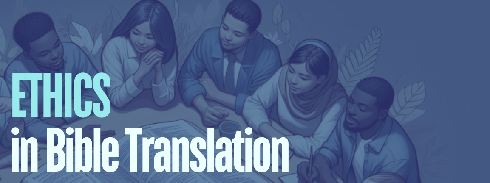

<!-- 
Relevant Google Doc: https://docs.google.com/document/d/1uO6C3rJgfFffG-EQJOK_aluTuBKqRrMNmiVeBB2S62s/edit?tab=t.0
-->

# 2025 Theme: Ethics in Translation

The theme will be ‘Ethics in Bible Translation’, picking up a topic being explored by the FOBAI Translation Development Group this year. 

We all get involved in Bible translation for different reasons, not least a sense of calling and desire to serve, while doing good and working towards transformation in peoples’  lives. However, this motivation does not exempt us from ethical considerations about our systems, practices, methods and strategies. What ethical lenses do we use to examine how we do what we do? Where does Bible translation intersect with issues like respect, justice, fairness, concern for the vulnerable, minimising harm, and avoiding control and exploitation? 

As you begin to think about, research and prepare for BT 2025, we offer the following sub-themes:

## Ethics of People and Communities

This lens focuses on the people involved in Bible Translation, including the language communities themselves, translators, facilitators, advisors, consultants, etc. We each participate in different ways and each role  deserves ethical examination. Translation also involves wider communities. Best practices and strategies take shape in particular contexts. What are the ethical issues involved with such contextualization?

## Ethics of Technology and Processes

Technology and Bible translation have a long history, from the inventions of writing, early books, the printing press, computers, to machine assisted translation and AI. New technology is emerging faster than ever before. What are the ethical issues we need to consider as we develop and use technology? What about other aspects of the translation process? Strategies for drafting, checking, and distributing also deserve an ethical appraisal.

## Ethics of Finances, Leadership and Communication 
Translation involves cultural mediation where there are often differences of power and differing cultural concepts of goal setting. Funding, decision making, quality assurance, access to resources, and messaging about activities and impact are some of the areas we need to consider. What are the ethical implications of such power relations?

## Ethics of Interpretation and Exegesis
Bible Translation always involves interpretation, and is shaped by our theological persuasions. What are the ethical frames that guide our practices and the ways we carry out exegesis? 

## Tracks
The abstract approval process and conference scheduling will be organised around the following six tracks: 
* Technology and Resources 
* Training and Mentoring 
* Theology, Hermeneutics, and Exegesis 
* Methodologies, Media, and Multimodality 
* Church and Community 
* Communication and Context

# Featured Speakers

## Dr. Matthijs de Jong

**[John Beekman Lecture Series](about.html#beekman) \#1**
Prof. dr. Matthijs J. de Jong (1977, The Netherlands) holds the Chair by Special Appointment of Bible Translation in Contemporary Context at Vrije Universiteit Amsterdam and is head of translation at the Bible Society for the Netherlands and Flanders.

De Jong studied in Leiden and Oxford and obtained his PhD at Leiden University. As a Bible translator he contributed extensively to the Dutch Bible in Plain Language (2014) and the revision of the Dutch Nieuwe Bijbelvertaling, resulting in the NBV21 (2021).

De Jong combines a broad research profile in Biblical studies with the specialism of Bible translation methodology. His primary research interest lies in contextualizing Bible translation, both as a historical phenomenon and as a contemporary activity.

## Dr. Kirk Franklin

**[John Beekman Lecture Series](about.html#beekman) \#2**

Kirk grew up in Papua New Guinea (PNG) amongst the Kewa people as a missionary kid (MK). As an adult, he joined Wycliffe US as a media-communications specialist and served with SIL International and the local Bible Translation Association. While in PNG, Kirk met and married Christine from NSW who was teaching at SIL’s primary school. Later Kirk served with Wycliffe Australia in media-communications, governance and executive leadership roles. From 2008-2020, Kirk was the Executive Director of the Wycliffe Global Alliance—comprised of over 100 organizations.

Kirk is now involved in research, training and teaching where he draws upon his years of mission executive roles and leading organizational change in a global mission agency. Kirk uses an interdisciplinary approach through the fields of missiology, intercultural studies, missional leadership and globalization. Kirk and Christine attend Warrandyte Community Church. The Franklins have three adult married children and three grandsons.

## Dr. Hephzibah Israel

**[Eugene A Nida Lecture Series](about.html#nida)**

I study intersections between translation, religion, history, and postcolonial studies. I have a keen interest in the way ideas, texts or objects considered sacred are translated across language cultures; and an equally keen interest in translation in archives. I teach translation theory and methods with a particular focus on literary translation and the sacred in translation. I retain a strong research interest in South Asian literary and translation cultures and contribute to teaching team-taught courses offered by the Centre for South Asian Studies, University of Edinburgh.

I have trained PhD students at the Translation Research Summer School and NIDA School of Translation Studies over several summers and taught on Erasmus Exchange programmes in Europe and India. I have also developed and organised early career researcher training for scholars based in India across the humanities disciplines.  This was funded by the British Academy (please see under projects for further details). I have mentored several Charles Wallace Fellows (postdoctoral research fellows based in Indian HEIs) at Edinburgh.

Before joining Edinburgh, I taught Literary Studies at the Open University's London Region and at the University of Delhi at St. Stephen College (1996-1997) and Lady Shri Ram College (1997-2009) in India. I hold postgraduate degrees in English Literature from the University of Delhi and specialised in translation studies as a Felix doctoral scholar at the School of Oriental and African Studies, University of London. My doctoral research focused on the Tamil Bible as a cultural object that was born out of debates on translation, language use, literature and religions in colonial south India.

## Dr. Rux Prompalit

**[Lamin Sanneh Lecture](about.html#sanneh)**  
Rux Prompalit is the chairperson of Wycliffe Thai Foundation (since 2017), advisor to the board of Linguistics Institute at Payap University, board member of Thailand Christian Business & Marketplace Connection (CBMC-Thailand), and treasurer of Thailand Community Based Tourism Institute Foundation.

Most of Rux’s professional life was at Payap University. He served as a lecturer and in various executive roles, including the president of Payap University. His teaching, research, and community services in the past 40 years focused in the fields of accountancy and business finance, micro finance, church finance, community-based tourism, and sustainable economy development.

Throughout his life at Payap, he contributed his expertise to local communities, government agencies, and private sectors, as well as serving in a national protestant church organization as an executive board member at schools, hospitals, church ministries, and businesses. Upon retirement, he continued teaching at the university, conducting research projects, and contributing his experiences to local churches and diverse groups of communities nationwide. Rux graduated with a PhD from the

University of Oregon (2003), MBA from the University of Central Oklahoma (1995), BBA from Chiang Mai University (1983), and a high school diploma from the Prince Royal’s College (1978).

Rux Prompalit was born and raised in a diverse environment of ethnic groups, cultures, and faiths in Northern Thailand. He was baptized at the First Church of Chiang Mai where he was a youth leader and a deacon. In his 20s, he transferred to be a member of Saitharnpraporn Church in Sansai District, Chiang Mai. Later, he became an ordained Elder. He has served as a vice-chair of the church Session since 2019. Rux and his wife live in Chiang Mai. They have two children and one granddaughter.

Rux’s Scripture favorite is, “Come to me, all you who are weary and burdened, and I will give you rest. Take my yoke upon you and learn from me, for I am gentle and humble in heart, and you will find rest for your souls. For my yoke is easy and my burden is light.” (Matthew 11:28-30 NIV)

## Dr. Freddy Boswell

**Banquet Address**  
Freddy Boswell works as a Senior Translation Consultant for SIL. He has served in a variety of SIL Global leadership roles, including Executive Director/CEO from 2008-2016, and International Translation Coordinator from 2000-2005. His field work experience has been based in Solomon Islands in the South Pacific, where he helped the Cheke Holo team complete their full Bible translation in 2022, and the Gao language finish their New Testament and Psalms in 2024. He currently assists various language groups and consultants-in-training in Eurasia, and he serves on the faculty of Dallas International University and the Canadian Institute of Linguistics. He is also the managing editor SIL’s Journal of Translation. He earned Bachelor’s and Master’s degrees in Biblical studies from Oral Roberts University, and a Ph.D. in Linguistics from Leiden University. He lives in Alabama, USA, and is married to Bekah. They have three married children and 3 grandchildren.